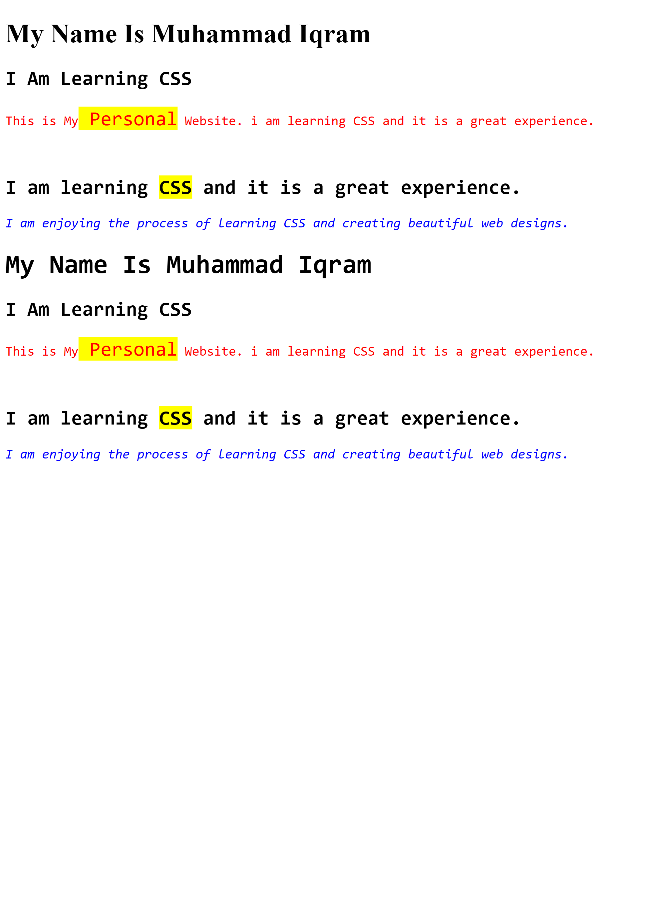

# 🎨 CSS Learning Journey

Daily code, exercises, and visual outputs tracking my journey from CSS fundamentals to advanced layouts.

---

## 📊 Daily Log & Progress

| Day | Topics / Details Covered | Previews |
| :---: | :--- | :--- |
| **Day 01** | **Introduction & Element Styling:** External stylesheet setup, targeting the paragraph selector (`p`), applying custom text color (`color: purple;`), and typography sizing (`font-size: 64px;`). |  |
| **Day 02** | **Typography, Selectors & Classes:** Semantic headings (`h1`, `h2`), text styling with `font-family: monospace`, element colors (`p { color: red; }`), and custom class styling (`.iqram` blue text vs `.Iqram` yellow background highlight). |  |